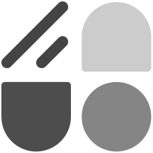

<p align="center">
  
  <h1 align="center">unocss-preset-shadcn</h1>
</p>

shadcn-ui but **unocss**, working with [shadcn-ui](https://ui.shadcn.com/) or [shadcn-vue](https://www.shadcn-vue.com/)

| lib | status |
| ---- | ---- |
| shadcn-ui | ✅ |
| shadcn-vue | ✅ |

## Motivation

As a fan of [unocss](https://unocss.dev/) and [shadcn-ui](https://ui.shadcn.com/), I wanted to combine them to take advantage of the speed and convenience that unocss brings. So I created this `unocss-preset`.

## Quick start

**❗️Notice**

from `unocss@0.57.0` color vars should remove dots. Change `--background: 0,0%,100%;` to `--background: 0 0% 100%;` [issue](https://github.com/unocss/unocss/issues/3274)

> Use the components codes in this project is **unnecessary**. These component codes are just for demonstration purposes. Just need `unocss` preset.

- [x] install `unocss`
- [x] touch `uno.config.ts`. copy `preset.shadcn.ts` into your project from [here](https://github.com/fisand/uno-shadcn-ui/blob/main/preset.shadcn.ts), then add it into `uno.config.ts`.

> If you use **shadcn-vue**, you should add some fields in `uno.config.ts`

```ts
// uno.config.ts
{
  ...yourConfig,
  shortcuts: [
    {
      'animate-accordion-up': 'accordion-up',
      'animate-accordion-down': 'accordion-down',
    },
  ],
  include: [/\.ts/, /\.vue$/, /\.vue\?vue/],
}
```

## Prepare to use shadcn-ui

- [x] `pnpm add lucide-react class-variance-authority clsx tailwind-merge`
- [x] copy [utils.ts](https://github.com/fisand/uno-shadcn-ui/blob/main/src/lib/utils.ts) into your project at `src/lib`
- [x] `pnpx shadcn add`

## Base on

- vite
- radix-ui
- unocss
- shadcn-ui
- shadcn-vue

## Docs

- [docs](https://uno-shadcn-doc.vercel.app/)
- [demo](https://uno-shadcn.netlify.app/)

## License

MIT
